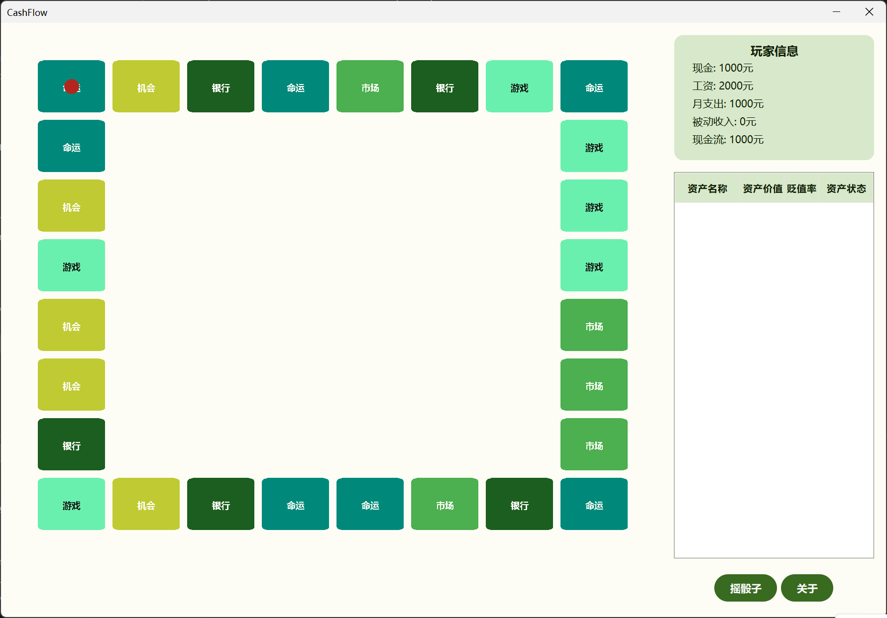
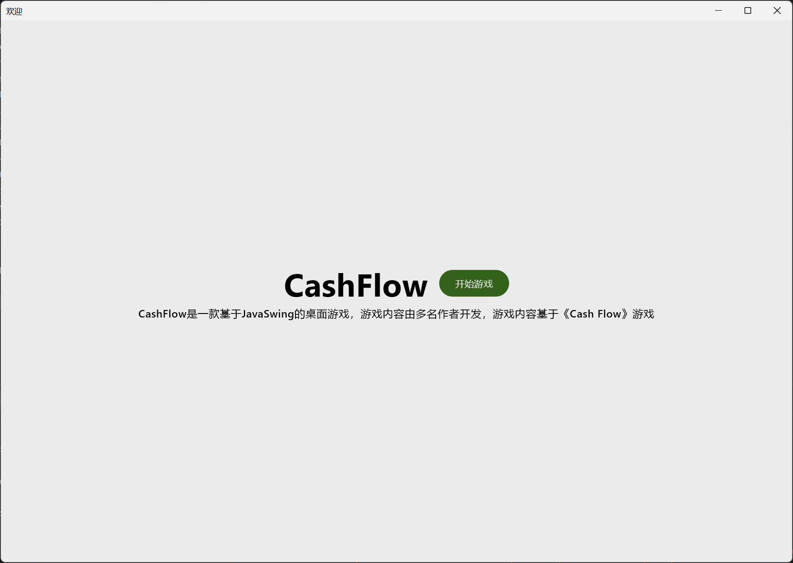

<p align="center">
<!-- ALL-CONTRIBUTORS-BADGE:START - Do not remove or modify this section -->
[](#contributors-)
<!-- ALL-CONTRIBUTORS-BADGE:END -->
  <h1 align="center">💰 CashFlow</h1>
  <p align="center">
    <strong>一款基于 Java Swing 与 Kotlin Compose Desktop 的现金流桌面游戏</strong>
  </p>
  <p align="center">
    
    
    
    
  </p>
</p>

---

## 📖 项目简介

**CashFlow** 是一款受经典桌游《Cash Flow》启发的桌面模拟游戏。玩家扮演一位普通上班族，通过投资、理财、应对各种人生事件。

游戏融合了现代 UI 设计风格（Material Design 3），采用 **Java + Kotlin** 混合开发模式，并集成了 **AI 智能对话系统**（基于 DeepSeek 模型），为玩家带来沉浸式的游戏体验。

---

## ✨ 核心特性

### 🎮 游戏玩法
- **棋盘式地图**：玩家掷骰子在地图上移动，每个格子触发不同事件
- **多样化事件系统**：银行、机遇、命运、市场等多种事件类型
- **资产管理**：管理现金、收入、支出、被动收入，追踪净资产变化
- **投资系统**：股票、房产、商业等多种投资渠道

### 🤖 AI 驱动体验
- **智能砍价系统**：与 AI 银行经理进行自然语言砍价对话
- **动态难度调整**：基于玩家表现智能调整游戏难度
- **基于 DeepSeek 模型**：高质量的对话生成能力

### 🎨 现代化 UI
- **Material Design 3**：遵循最新设计规范
- **Kotlin Compose Desktop**：流畅的跨平台 UI 体验
- **动画系统**：包含骰子动画、玩家移动动画等丰富视觉效果

### 🎯 小游戏模块
- **MiniImpact 物理引擎**：内置 2D 物理模拟（碰撞检测、速度向量计算）
- **赌球游戏**：基于物理引擎的趣味小游戏
> 以下内容由 Syrnaxei 贡献
- **2048**：经典的数字游戏
- **打气球**：经典的打气球游戏


### 💻 作弊功能
- **Python解释器**：可执行相关指令控制游戏
- **地图刷新**：可刷新地图
---

## 🛠️ 技术栈

| 类别 | 技术 |
|------|------|
| **核心语言** | Java 21, Kotlin 1.9.20 |
| **UI 框架** | Java Swing, Jetpack Compose Desktop 1.5.11 |
| **构建工具** | Gradle |
| **AI 集成** | DeepSeek API |
| **网络请求** | Java HttpClient |
| **JSON 处理** | Jackson Databind |
| **外观主题** | FlatLaf 3.7 |
| **脚本支持** | GraalVM Polyglot (Python) |

---

## 📂 项目结构

```
Project_Cash/
├── src/main/java/top/liewyoung/
│   ├── agentTools/          # AI Agent 工具集
│   │   ├── BargainAgent.java    # 砍价代理
│   │   ├── ChatRequest.java     # 聊天请求封装
│   │   └── Message.java         # 消息模型
│   ├── config/              # 配置加载器
│   ├── math/                # 数学工具
│   │   └── Vector.java          # 向量运算
│   ├── network/             # 网络请求模块
│   │   ├── Requests.java        # HTTP 请求工具
│   │   └── response/            # 响应模型
│   ├── strategy/            # 游戏策略层
│   │   ├── asset/               # 资产系统
│   │   ├── gameEvent/           # 事件系统
│   │   │   ├── events/
│   │   │   │   ├── bank/        # 银行事件
│   │   │   │   ├── fate/        # 命运事件
│   │   │   │   ├── market/      # 市场事件
│   │   │   │   ├── opportunity/ # 机遇事件
│   │   │   │   └── fungame/     # 小游戏事件
│   │   │   ├── EventContext.java
│   │   │   ├── EventRegistry.java
│   │   │   └── GameEvent.java
│   │   ├── MapPostition.java
│   │   └── TitlesTypes.java
│   ├── thanos/              # 小游戏模块
│   │   ├── miniImpact/          # 物理引擎
│   │   │   ├── core/
│   │   │   │   ├── Ball.java
│   │   │   │   ├── PhysicalEngine.java
│   │   │   │   └── MiniImpact.java
│   │   │   └── api/
│   │   │       └── RunBetBall.java
│   │   ├── PythonInterpreter.kt # Python 脚本解释器
│   │   └── CommandRegistry.kt
│   └── view/                # 视图层
│       ├── ColorSystem/         # 主题颜色系统
│       ├── component/           # UI 组件
│       ├── displayFonts/        # 字体配置
│       ├── mainWindows/
│       │   ├── HomePageCompose.kt   # 主页（Compose）
│       │   ├── MapDraw.java         # 地图绘制
│       │   └── DashboardPanel.java  # 仪表盘面板
│       ├── tools/
│       └── Stater.java          # 游戏启动器
├── docs/                    # 文档
├── build.gradle             # 构建配置
├── settings.gradle
└── LICENSE                  # MIT 许可证
```

---

## 🚀 快速开始

### 环境要求

- **JDK 21** 或更高版本
- **Gradle 8.x**（或使用项目自带的 Gradle Wrapper）

### 克隆项目

```bash
git clone https://github.com/LiewYoung/Project_Cash.git
cd Project_Cash
```

### 运行游戏

```bash
# 使用 Gradle Wrapper 运行
./gradlew run

# 或在 Windows 上
gradlew.bat run
```

### 构建项目

```bash
./gradlew build
```

---

## 🎮 游戏指南

### 游戏目标

通过合理的投资和理财决策，积累足够的被动收入，使其超过支出，实现**财务自由**！

### 事件类型

| 事件类型 | 图标 | 描述 |
|---------|------|------|
| **银行** | 🏦 | 存款、取款、贷款、还款、砍价降息 |
| **机遇** | 🎯 | 投资股票、房产、商业机会 |
| **命运** | 🎲 | 随机事件，可能是惊喜或意外支出 |
| **市场** | 📈 | 通胀事件、股市波动、房产市场变化 |
| **小游戏** | 🎮 | 趣味物理小游戏，赢取额外奖励 |

### 操作说明

1. 点击**开始游戏**进入游戏主界面
2. 右侧面板显示当前玩家的财务状况
3. 点击**掷骰子**移动角色
4. 根据落地格子的类型，系统会弹出相应事件
5. 做出明智的财务决策！

---

## 🔧 配置说明

### AI 功能配置

创建配置文件 `config.properties`（放置于项目根目录或资源目录）：

```properties
# DeepSeek API 配置
deepseek.api.url=https://api.deepseek.com/chat/completions
apiKey=your-api-key-here
model=deepseek-chat
```

> ⚠️ 请勿将 API Key 提交到版本控制系统中<br>
>本项目gitignore已配置

---

## 📸 截图展示





---

## 🤝 贡献指南

欢迎各种形式的贡献！

1. **Fork** 本仓库
2. 创建特性分支：`git checkout -b feature/amazing-feature`
3. 提交更改：`git commit -m 'Add some amazing feature'`
4. 推送到分支：`git push origin feature/amazing-feature`
5. 提交 **Pull Request**

### 代码规范

- Java 代码遵循 Google Java Style Guide
- Kotlin 代码遵循官方 Kotlin Coding Conventions
- 提交信息使用中文或英文均可，保持清晰明了
### 文档获取
- 使用 Gradle dokka 插件生成文档
- 文档存放在 build/dokka/ 目录下

---

## 📜 许可证

本项目采用 **MIT 许可证** 开源。详见 [LICENSE](LICENSE) 文件。

```
MIT License
Copyright (c) 2025 Liew.Y
```

---

## 👨‍💻 作者

**LiewYoung** - <SunCanHelpU@outlook.com>

---

## 🙏 致谢

- 《Cash Flow》原版桌游 - 游戏玩法灵感来源
- [JetBrains](https://www.jetbrains.com/) - 优秀的开发工具
- [DeepSeek](https://www.deepseek.com/) - AI 模型支持
- [FlatLaf](https://www.formdev.com/flatlaf/) - 现代化 Swing 主题

---

<p align="center">
  <strong>🌟 如果这个项目对你有帮助，欢迎 Star！🌟</strong>
</p>

## Contributors ✨

Thanks goes to these wonderful people ([emoji key](https://allcontributors.org/docs/en/emoji-key)):

<!-- ALL-CONTRIBUTORS-LIST:START - Do not remove or modify this section -->
<!-- prettier-ignore-start -->
<!-- markdownlint-disable -->
<table>
  <tbody>
    <tr>
      <td align="center" valign="top" width="14.28%"><a href="https://github.com/Syrnaxei"><br /><sub><b>Syrnaxei</b></sub></a><br /><a href="https://github.com/LiewYoung/Project_Cash/commits?author=Syrnaxei" title="Code">💻</a></td>
      <td align="center" valign="top" width="14.28%"><a href="https://github.com/MMMorning-eve"><br /><sub><b>MMMorning-eve</b></sub></a><br /><a href="https://github.com/LiewYoung/Project_Cash/commits?author=MMMorning-eve" title="Code">💻</a></td>
    </tr>
  </tbody>
</table>

<!-- markdownlint-restore -->
<!-- prettier-ignore-end -->

<!-- ALL-CONTRIBUTORS-LIST:END -->

This project follows the [all-contributors](https://github.com/all-contributors/all-contributors) specification. Contributions of any kind welcome!